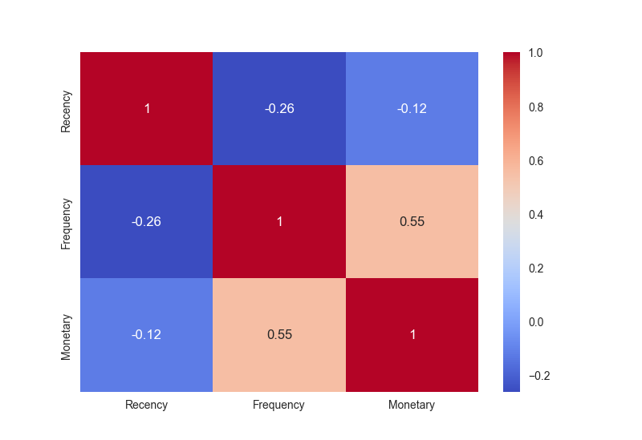
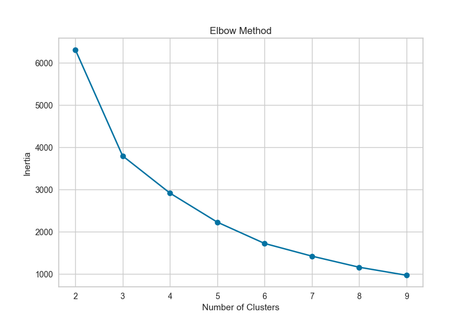
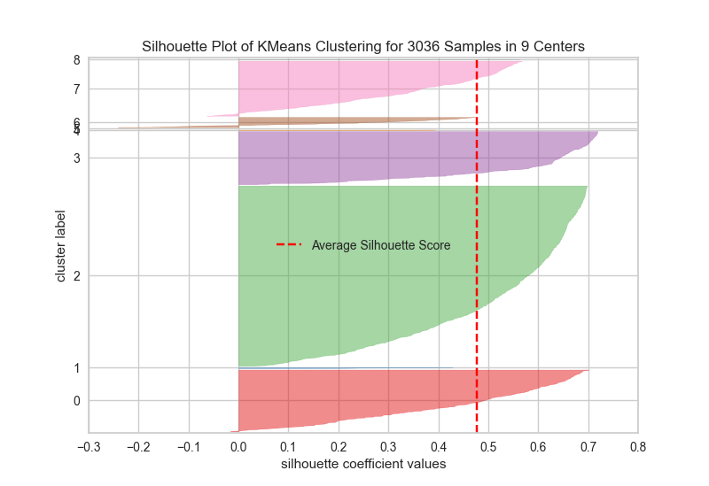

# 🧠 Customer Segmentation using RFM and K-Means

Customer segmentation is a powerful way for businesses to understand and group their customers based on behavior. This project performs **RFM Analysis** (Recency, Frequency, Monetary) and uses **K-Means Clustering** to discover unique customer segments from retail transaction data.

---

## 📦 Dataset

- **File**: `Online Retail.xlsx`  
- **Description**: Real-world online retail dataset containing transactions from 2010–2011.  
- **Key Fields**: `CustomerID`, `InvoiceNo`, `InvoiceDate`, `Quantity`, `UnitPrice`

---

## 🔁 Workflow Overview

### 🔹 1. Data Preprocessing
- Removed rows with missing `CustomerID`
- Filtered out transactions with negative `Quantity` or `UnitPrice`
- Created a new column: `TotalPrice = Quantity × UnitPrice`

### 🔹 2. RFM Feature Engineering
- **Recency**: Days since last purchase (from the most recent date)
- **Frequency**: Number of unique purchases (`InvoiceNo`)
- **Monetary**: Total spending per customer

### 🔹 3. Exploratory Data Analysis

#### 🔍 Pairplot of RFM Features  


#### 📊 Correlation Heatmap  


---

### 🔹 4. Clustering

#### 📈 Elbow Method to Select Optimal K  


#### 🟣 Silhouette Score Visualization  


- Optimal number of clusters (`k`) is chosen based on lowest inertia and silhouette evaluation.

---

### 🔹 5. Final Pipeline
- Created a reusable **scikit-learn pipeline** with:
  - `StandardScaler`
  - `KMeans`
- Trained on the RFM features and predicted segments across the dataset.

---

## 📤 Output

- **`customer_segments.csv`**:
  - Contains: `CustomerID`, RFM metrics, assigned cluster
- Use these segments to identify:
  - VIP customers
  - At-risk/dormant users
  - Frequent but low spenders
  - New or seasonal shoppers

---

## 🛠️ Tech Stack

- Python 3  
- `pandas`, `numpy`, `matplotlib`, `seaborn`, `yellowbrick`  
- `scikit-learn` for clustering and pipeline  
- `jupyter` for interactive development

---

## 🚀 Getting Started

1. Clone the repo
   ```bash
   git clone https://github.com/yourusername/customer-segmentation.git
   cd customer-segmentation

2. Install dependencies
   ```bash
    pip install -r requirements.txt

3. Place dataset in the project root.

4. Run the script to generate visualizations and the final csv.
    ```bash
    python main.py